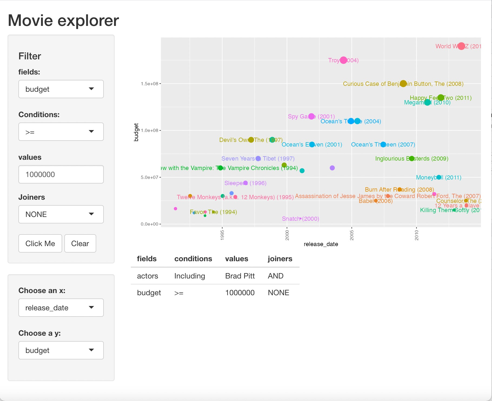

```{r setup, include=FALSE}
knitr::opts_chunk$set(echo = TRUE)
```

## Project Background

In this project we develop an interactive visualization tool which helps movie fans to answer questions of interest. Questions which they could not be able to answer at their fingertips because of a lack of a one stop interactive dashboard that houses the disparate big data movie data set all over the web. Questions like "how much money did Denzel Washington's movies make on their first weekend?" or "how much budget did Arnold Schwarzenegger movies had?".

## Github repository

All of the code for this project is freely available at https://github.com/abner-hb/shiny-movies.

## Data
We combine data from ImDb and MovieLens to build a database containing information on more than twenty thousand movies. We have information about the movies' genres, date of release, country of origin, director, main cast, production companies, budget, revenue on opening weekend, duration, and critical rating.

## Method
We use a *Shiny* application that calls functions from RSQLite, dplyr and ggplot to select and plot data based on the inputs chosen in a web-based interface.  
  The app works as follows: first, the user chooses the variables that he wants to visualize and how—for example, date of release in the horizontal axis and opening revenue in the vertical axis; then, the app builds a table with the relevant data; after that, the app plots the data and the user can see it.  
	The main challenge is transforming user inputs from a user-friendly interface into instructions that R can execute.

### Description of interface
The *Shiny* app is made of two parts, one as user interface and the other as server. The user interface (ui) object controls the layout and appearance of our app. The server function contains the instructions that our computer needs to build our app.     
In the UI section, we separated the input into two parts. First part is filter which allows the user to filter the dataset they would like to use and we added a button that enables the user to add more filtering criterias. The second part is plotting which allows the user to select the x-axis variable and y-axis variable.    
In the server section, we collect all the instructions from the user input and made them as a table. Then we passed the function of filtering data and building plot to render our plots.
Once the user fill out the filtering instructions and select x-axis and y-axis, the plot will be rendered after they click the render plot button.

```{r echo=FALSE, fig.align='center', fig.cap='example of the application', out.width = '65%', eval = FALSE}

```

\includegraphics{"./snapshot/snapshot.jpg"}

### Filtering data
As seen above, our app must be able to pass as inputs combinations of instructions like "movie name contains a string" or "movie budget is above a certain amount". Using dplyr or base R syntax it is relatively easy to pass names and values of columns, but it is difficult to transform instructions like "including" and "lesser than".

With SQL syntax it is straightforward to pass these instructions because SQL queries are made entirely of strings. Thus, we can pass the user inputs as strings into a function that "formats" the instructions and then builds a SQL query to extract information from our movies database.  
To filter the data, we use the following algorithm

1. First organize the user input in a table with four columns: fields, conditions, values, joiners. Fields refers to the variables that the user wants to filter by, e.g., actor name; values refers to what the user wants the filter to be (e.g., Brad Pitt),  and conditions refers to how it is filtered ("Including"); joiners refers to how the user wants to combine filters. Consider the following example: the user wants to use all the movies that featured Brad Pitt and had a budget of at least 1 million dollars. Then, the table of inputs will look like table 1.

2. We rewrite the entries of the table as instructions in SQL syntax. For example, we substitute "Including" for the SQL command "LIKE" (see code for details).    

3. We put together the instructions from the table and write a SQL query.    
4. We extract the information from our movies data using the query written.  

| fields | conditions | values  | joiners |
|:------:|:----------:|:-------:|:-------:|
| actors |  Including |Brad Pitt|   AND   |
| budget |     >=     | 1000000 |   NONE  |

: Example of table of user inputs

### Building plots
To create the data graphics that answer the questions the user has we use the ggplot2 graphics package. We created a function that takes in arguments from the user and plots relationships of the variables the user is interested in. The first argument is the filtered dataset described in the above section, the second and third arguments of the function could be any of the variables such as movie release date and budget.  The function adds layers to the ``ggplot()`` through the geom functions: ``geom_point()`` and ``geom_text()`` which map select variables to visual properties.  
Since this is a huge dataset to curb the problem of overlapping we use the parameter ``check_overlap`` which automatically removes overlapping labels.

## Contributions
**Abner Heredia Bustos**: gathering and cleaning data to use it; designing the outline of the app; writing the code to filter data "on the fly" according to user inputs; helping debug other aspects of the app.   
**Runshu Wang**: designing the interface of the app; writing the shiny app code to accomplish visualization of the plot.  
**Sihle Khanyile**: writing the plotting function.